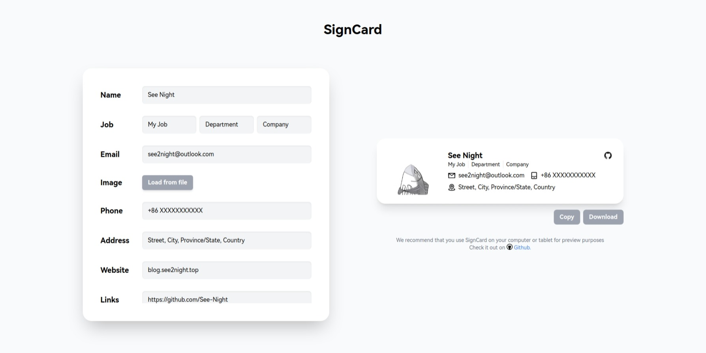

# SignCard

 

SignCard is a tool that automatically generates email signatures. It uses a neumorphism design that can give your email a whole new style. SignCard works completely offline, without any network request except interface loading, so you don't have to worry about your personal information being leaked.

You can access [SignCard](https://blog.see2night.top/SignCard) in browser.

Note that SignCard generates signatures as HTML files and requires your mail client to support adding HTML files as mail signatures, such as Thunderbird, Evolution, etc., or you add signatures to mail directly using a programmatic way.

Of course, if you don't mind, you can just take a screenshot from the preview and use it.

## Usage

You can enter your personal information into the corresponding input field, and SignCard will generate a preview in real time (for large-screen devices only).
You can add more than one related link, and SignCard will automatically get the link icons and add them after the name.

Once you have filled in your personal information, you can click the Download button to download the signed HTML file, or click the Copy button to copy the HTML content to the clipboard.

## Preview

